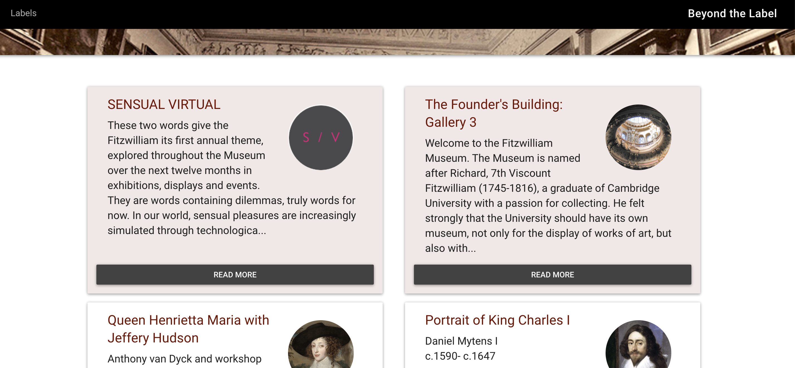

# Beyond the Label- Fitzwilliam Museum

Release 1.0 code: 

This repository will hold code for the Beyond the Label project. This project
contains data pulled from AdLib, curatorial interpretation, video and audio content and additional materials. It is written in Jekyll, hosted on GH-Pages and is an experimental piece.

The museum's visitors will be invited to visit the pages on this site by access methods in gallery such as:

* NFC
* QR Code
* Short URL

These will have identifiers to show the method which was used to interact so we can see how successful this trial is.

## To run locally

* Install Jekyll on your machine following these [instructions](https://jekyllrb.com/docs/installation/)
* Install Git on your machine following these [instructions](https://git-scm.com/book/en/v2/Getting-Started-Installing-Git)
* Clone the code for this repository:
   `git clone https://github.com/FitzwilliamMuseum/beyond-the-label.git beyond-the-label`
* Change to the directory and then run this command in terminal `bundle exec jekyll serve`

## Credits

Copyright the University of Cambridge unless noted otherwise.

Website by [@portableant](https://github.com/portableant) and [@choekyi](https://github.com/choekyi)

CSS framework: http://daemonite.github.io/material/

## Licenses

* AGPL for code
* CC-BY for content (text and images) unless stated
otherwise
* Some content is under institutional licence and will be highlighted if so.

## Contributing guidelines

If you want to contribute fixes to this site, you are very welcome to do so. To
do this, either add a [bug report under issues](https://github.com/FitzwilliamMuseum/beyond-the-label/issues) or fork the repository and create a new branch for proposed fixes and then submit
a pull request.
